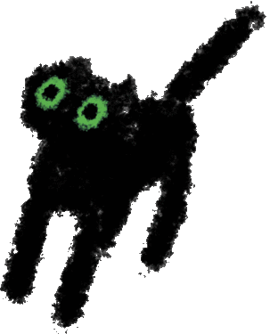

<h1>
  &nbsp;&nbsp;&nbsp;
   
  Hey 👋, I'm bonzi&nbsp;&nbsp;&nbsp;
</h1>

* Interested in API and app reverse engineering, automation, [web scraping](https://github.com/user-attachments/assets/b3ebd97b-2832-41b6-ac65-f751a3400e07), network debugging, and web/android development (mildly obsessed with figuring out how things work).
* Full-time hating on using Selenium WebDriver for scraping websites (because apparently the best way to collect data is to recreate the entire human experience first :D).
* Used to work with leaked website data and automation of website endpoints.

## Currently contributing to:

* [FreakLog](https://github.com/pilz0/better-journal) (better-journal): a modified and improved version of [PyschonautJournal](https://github.com/isaakhanimann/psychonautwiki-journal-android).
* [AnodyneWiki](https://github.com/AnodyneWiki): templated maintainable pharmacology and harmreduction meta-wiki.

## I usually work with:

  
  
  
  
  
  
  
  
  
  
  
  
  
  
  
  
  

-----

  

